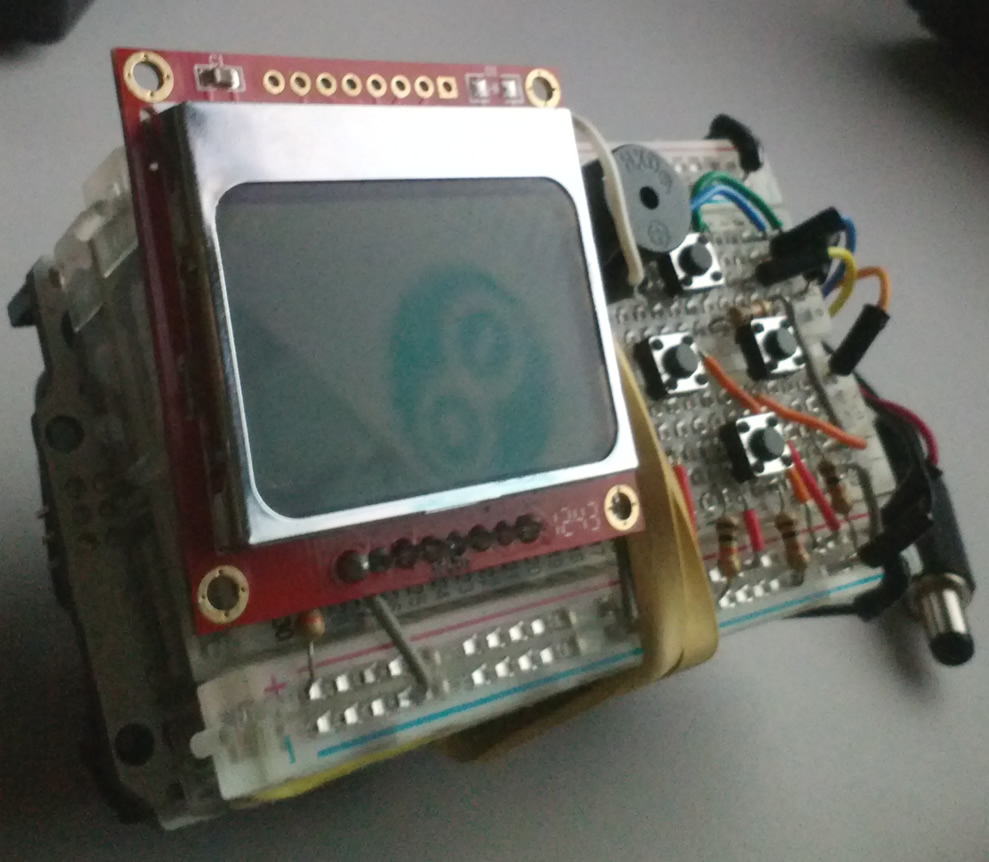

# Snake Duino v1

Arduino Snake game

Inspirated in [Snake v1.0][1], Ouarrak Ayoub

## Components

- Nokia 5110 LCD attached to pins 7, 6, 5, 4, 3
- Active Buzzer attached to pin 8
- Push-buttons attached to pins A2, A3, A4, A5

## License

"THE BEER-WARE LICENSE" (Revision 42): [phk@FreeBSD.ORG]() wrote this file.

As long as you retain this notice you can do whatever you want with this stuff. If we meet some day, and you think this stuff is worth it, you can buy me a beer in return Poul-Henning Kamp

[1]: http://pastebin.com/iAVt9AGJ
